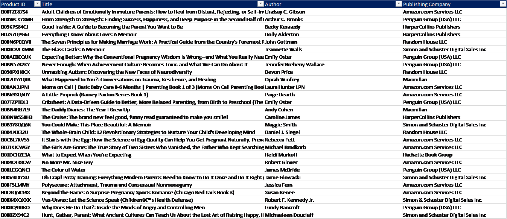
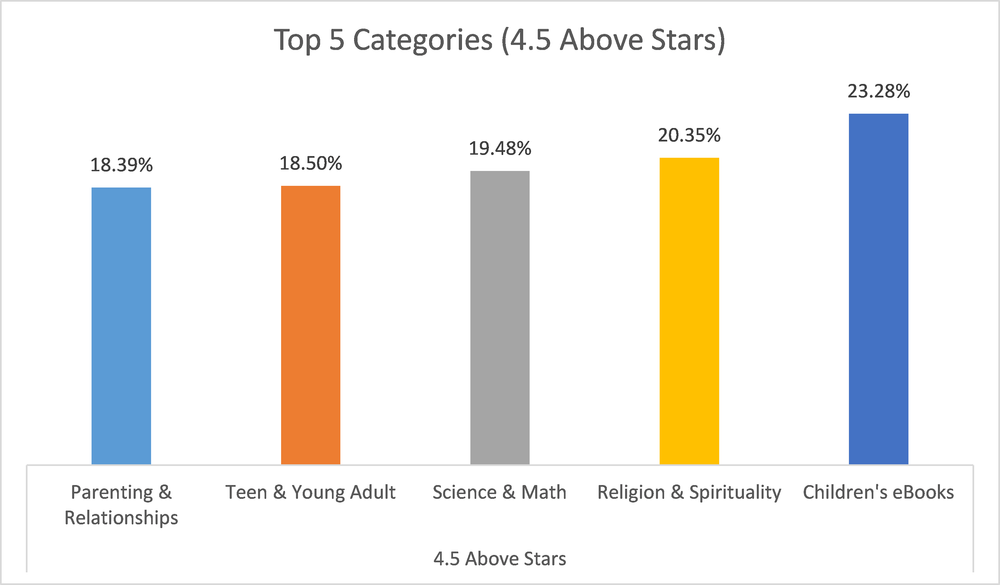
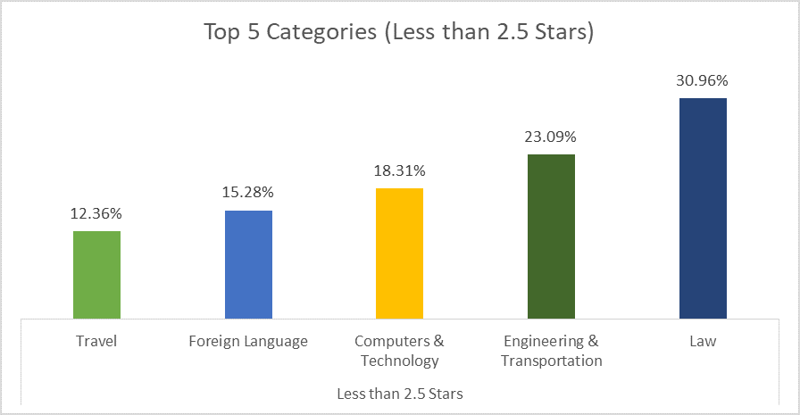
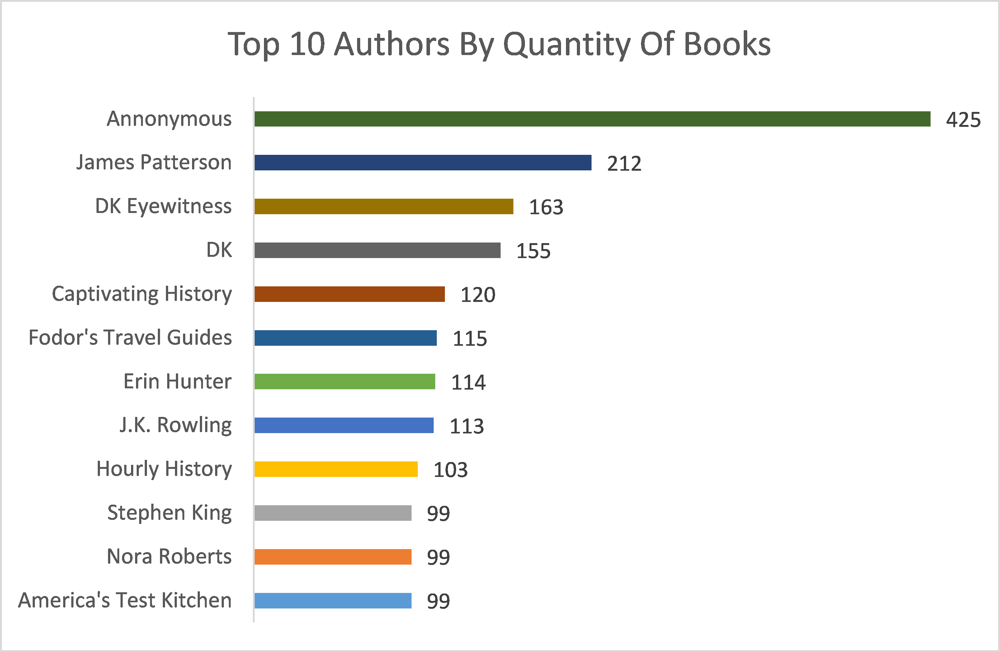
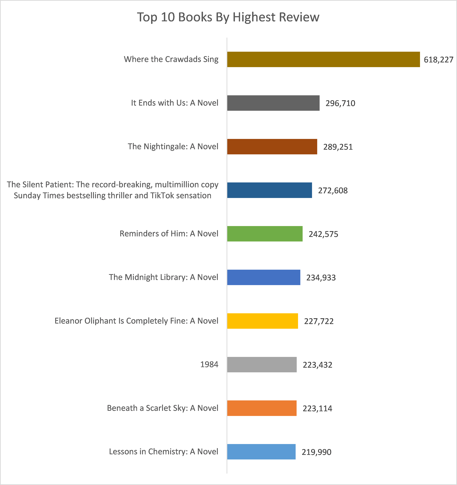
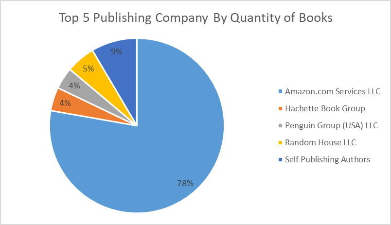
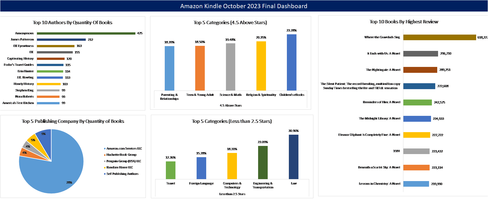

# Amazon Kindle Books Analysis

---
## Introduction
This Excel project focuses on analyzing Amazon Kindle book data scraped in October 2023. The objective is to derive insights that will aid Mr. John in launching his new book publishing company.

---
Mr. John, a prospective client, has approached us via email seeking assistance in setting up his publishing venture. Before officially launching his company, he wishes to gain insights from Amazon Kindle data.

---

### Kindly download the Excel files below: 

Raw Dataset - [Here](https://www.dropbox.com/scl/fi/9tboqvsnlq0d755526fqy/Amazon-Kindle-Data-October-2023-Dataset.csv?rlkey=qb3lk16zzfw1wjpv3z6uji0yy&st=5ir1wcvz&dl=0)  

---
## Problem Statement:
Mr. John seeks the following insights for his new publishing company:

I.	Identify the top 5 book categories with ratings of 4.5 stars and above to prioritize publishing in these genres.

II.	Identify the top 5 book categories with ratings below 2.5 stars to avoid publishing in these genres.

III.	Identify the top 10 books with the highest reviews to gain diverse perspectives and insights.

IV.	Identify the top 10 authors with the highest quantity of books to explore collaboration opportunities.

V.	Identify the top 5 publishing companies on Amazon Kindle for competitive market research and strategic planning.

## The Final Dashboard and Analysis (Visualization Workbook):

The report Comprises of 6 different worksheets:

I.	Cleaned Dataset

II.	Final Dashboard

III.	Authors Analysis

IV.	Publishing Companies Analysis

V.	Category Analysis

VI.	Book Analysis.

## Skills Demonstrated:
The Following Excel Features were used:

I. Data Cleaning

II. If Function

III. Standard Pivot table

IV.	Pivot Chart

V. Sorting & Filtering

VI.	Data Analysis

VII. And More…

## Data Transformation:

Raw Dataset                     |      Cleaned Dataset
:------------------------------:|:---------------------------:
 | 

I.	Column headers were updated to standard names like Product ID, Title, Author, Publishing Company, etc., for consistency.

II.	To ensure consistency, the Product ID datatype was uniformly adjusted to Text format.

III.	Missing author names were replaced with "Anonymous" to maintain dataset completeness.

IV.	Empty publishing dates were set to 1st October 2023 to ensure uniformity and completeness.

V.	Boolean values were simplified to "Yes" for True and "No" for False, improving clarity and understanding across the dataset.

VI.	And More...

## Analysis:

### Top 5 Categories (4.5 Stars and Above):

After conducting a thorough analysis and utilizing the IF function, the top 5 categories with ratings of 4.5 stars and above are as follows:

•	Children's Ebook (23.28%)

•	Religion & Spirituality (20.35%)

•	Science & Math (19.48%)

•	Teen & Young Adult (18.50%)

•	Parenting & Relationship (18.39%)

### Top 5 Categories (Less than 2.5 Stars):

Following critical analysis and the utilization of the IF function, the top 5 categories with ratings below 2.5 stars are as follows:

•	Law (30.96%)

•	Engineering & Transportation (23.09%)

•	Computer & Technology (18.31%)

•	Foreign Language (15.28%)

•	Travel (12.36%)

### Top 10 Authors by Quantity of Books:

The top 10 authors, ranked by the quantity of books, are as follows:

•	Anonymous (425)

•	James Patterson (212)

•	DK Eyewitness (163)

•	DK (155)

•	Captivating History (120)

•	Fodor's Travel Guides (115)

•	Erin Hunger (114)

•	J.K. Rowling (113)

•	Hourly History (103)

•	Stephen King (99)

•	Nora Roberts (99)

•	American Test Kitchen (99)

### Top 10 Books by Highest Review:

The top 10 books, ranked by the highest review count, are as follows:

•	"Where the Crawdads Sing" (618,227)

•	"It Ends with Us: A Novel" (296,710)

•	"The Nightingale: A Novel" (289,251)

•	"The Silent Patient: The Record-Breaking, Multimillion-Copy Sunday Times Bestselling Thriller and TikTok Sensation" (272,608)

•	"Reminders of Him: A Novel" (242,575)

•	"The Midnight Library: A Novel" (234,933)

•	"Eleanor Oliphant Is Completely Fine: A Novel" (227,722)

•	"1984" (223,432)

•	"Beneath a Scarlet Sky: A Novel" (223,114)

•	"Lessons in Chemistry: A Novel" (219,990)

### Top 5 Publishing Companies by Quantity of Books:

The top 5 publishing companies, based on the quantity of books published, are as follows:

•	Amazon.com Service LLC (78%)

•	Hachette Book Group (4%)

•	Penguin Group (USA) LLC (4%)

•	Random House LLC (5%)

•	Self-Publishing Authors (9%)

## Conclusion:

After analyzing the October 2023 dataset from Amazon Kindle, several key insights have been uncovered. The top categories with ratings of 4.5 stars and above include Children's Ebook, Religion & Spirituality, Science & Math, Teen & Young Adult, and Parenting & Relationship. Conversely, categories such as Law, Engineering & Transportation, Computer & Technology, Foreign Language, and Travel have received ratings below 2.5 stars, suggesting potential areas to avoid for publishing.

Furthermore, notable authors with a significant quantity of books include James Patterson, DK Eyewitness, DK, Captivating History, Fodor's Travel Guides, Erin Hunger, J.K. Rowling, Hourly History, Stephen King, Nora Roberts, and American Test Kitchen. Additionally, highly-reviewed books such as "Where the Crawdads Sing," "It Ends with Us: A Novel," and "The Nightingale: A Novel" indicate popular choices among readers.

In terms of publishing companies, Amazon.com Service LLC dominates the market with a majority share, followed by Hachette Book Group, Penguin Group (USA) LLC, Random House LLC, and self-publishing authors.
## Recommendation:

Based on the insights gathered from the analysis, it is recommended that Mr. John consider focusing his publishing efforts on genres with high ratings, such as Children's Ebook, Religion & Spirituality, and Science & Math. These categories demonstrate strong reader satisfaction and engagement, indicating potential for success in publishing ventures.

Additionally, Mr. John should avoid categories with lower ratings, such as Law, Engineering & Transportation, and Computer & Technology, to mitigate the risk of publishing unpopular content.

In terms of collaboration opportunities, Mr. John should explore partnerships with prolific authors identified in the analysis, such as James Patterson and J.K. Rowling. Collaborating with these established authors can help elevate the visibility and credibility of GLWY Ltd (Greatness Lies Within You Ltd) in the competitive publishing industry.

Furthermore, Mr. John should closely monitor market trends and competitor activity, particularly the dominance of Amazon.com Service LLC. Understanding market dynamics and consumer preferences will be crucial for strategic planning and decision-making as GLWY Ltd establishes itself in the publishing landscape.

Overall, by leveraging the insights gathered from the analysis and adopting a strategic approach to publishing, Mr. John can position GLWY Ltd for success and achieve its goal of becoming a prominent player in the book publishing industry. Thank You for Reading! Stay Blessed!!
  
### Disclaimer:
Mr. John is a fictional client, and his new company GLWY Ltd (Greatness Lies Within You Ltd) is purely hypothetical and does not represent any existing entity. The dataset used is authentic and was sourced from publicly available Amazon Kindle data in October 2023.
